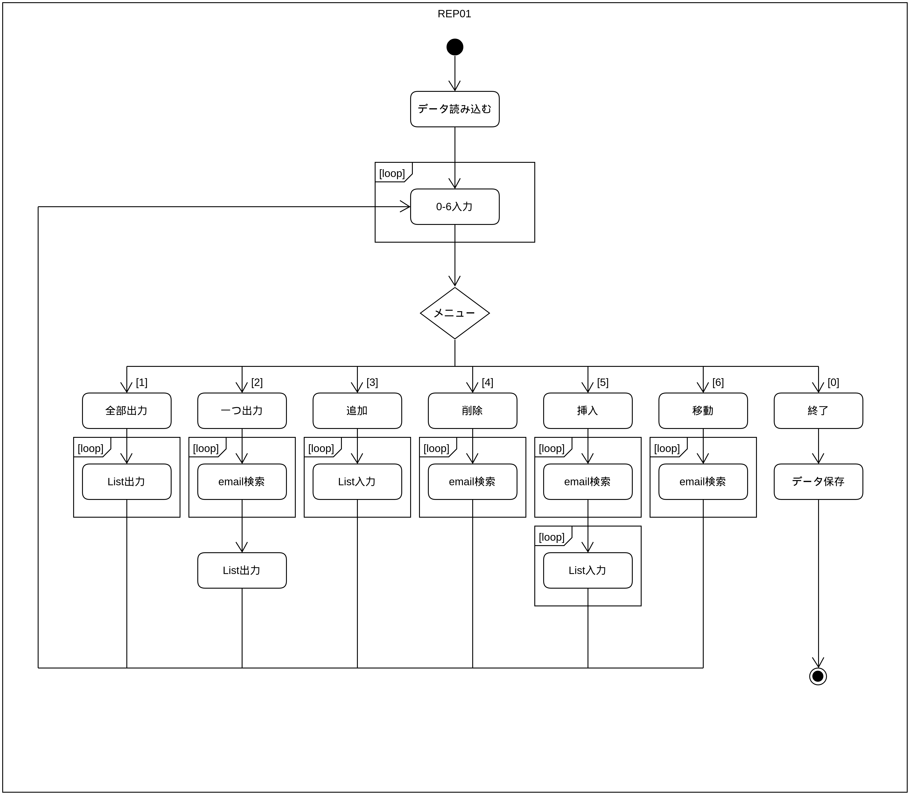

# REP01

所属：京都コンピュータ学院情報処理科

作成者：ラーション・ステファン、学生番号：E20C4033

---
## 概要 (Verify this later)

* [ 外部仕様 ](#specifications)
* [ 内部設計・プログラムの詳細 ](#design)
* [ 流れ ](#flowchart)
* [ 特徴 ](#notes)
* [ 関数の説明 ](#functions)
* [ テスト方法 ](#testing)
* [ まとめ ](#summary)

---
## 外部仕様
<a name="specifications"></a>
C言語でプログラミングしたアドレス帳を作っていました。

端末を使用して、アドレスを追加したり、挿入したり、色々な機能が含めています。
more here!

---
## 内部設計・プログラムの詳細
<a name="design"></a>

### 流れ <a name="flowchart"></a>


### 特徴 <a name="notes"></a> - 必修なところ以外では、自分で頑張ってテップアップしました。
* ファイルで保存・読み込み
* 入力確認

### 関数の説明 <a name="functions"></a>

| ファイル名     | 関数名       | 引数              | 戻り値       | 説明                         |
| ------------ | ------------ | ---------------- | ----------- | --------------------------- |
| REP01.c      |              |                  |             |                             |
|              | main         | （なし）          | int         | メイン                        |
|              | int_input    | （なし）          | int         | メニュー入力                   |
|              | clear        | （なし）          | （なし）     | インプットバッファを消す         |
| address.c    |              |                  |             |                             |
|              | printAll     | List *pHead      | （なし）     | 全部のアドレスを出力            |
|              | print        | List *pHead      | （なし）     | アドレスを細かくて出力          |
|              | add          | List *pHead      | （なし）     | アドレスを追加                 |
|              | edit         | List *pHead      | （なし）     | アドレスを挿入                 |
|              | move         | List *pHead      | （なし）     | アドレスを削除                 |
|              | destroyAll   | List *pHead      | （なし）     | 全部のアドレスを削除            |
|              | destroy      | List *pHead      | （なし）     | アドレスを削除                 |
|              | string_input | char *c, int s   | char *      | 文字型入力                    |
|              | find         | List *pHead      | List *      | emailでアドレスを検索          |
|              | new          | List *node       | （なし）     | アドレス入力                   |
| io.c         |              |                  |             |                             |
|              | write        | List *pHead      | （なし）     | アドレスをXMLファイルで保存      |
|              | read         | List *pHead      | int         | アドレスをXMLファイルから読み込む |
| validation.c |              |                  |             |                              |
|              | is_email     | char *           | int         | emailをregexpで確認            |
|              | is_empty     | char *           | int         | 空のstring確認                 |

---
## テスト方法 <a name="testing"></a>
#### コンパイル
```bash
gcc REP01.c address.c -o REP01;
```

#### 実行
```bash
./REP01;
```

---
## まとめ <a name="summary"></a>

summary here

REMOVE IF NOT NEEDED
* REP01.c - main()、メニュー処理
* address.c - アドレス帳に関する関数
* io.c - アドレス帳のデータを保存したり、読込みしたりする関数
* build.sh - コンパイルして実行するためのスクリプト(Linux用)
* validation.c - 入力確認ための関数
