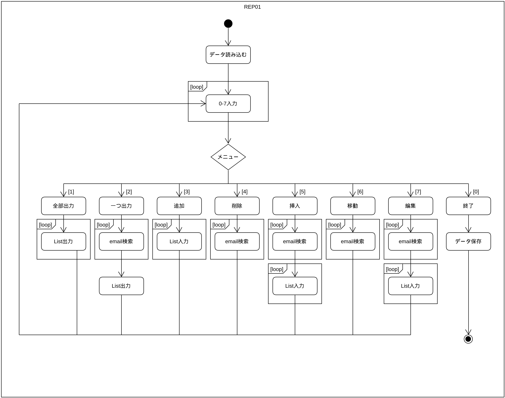

# REP01

所属：京都コンピュータ学院情報処理科

作成者：ラーション・ステファン、学生番号：E20C4033

---
## 概要 (Verify this later)

* [ 外部仕様 ](#specifications)
* [ 内部設計・プログラムの詳細 ](#design)
* [ 流れ ](#flowchart)
* [ 特徴 ](#notes)
* [ 関数の説明 ](#functions)
* [ テスト方法 ](#testing)
* [ まとめ ](#summary)

---
## 外部仕様
<a name="specifications"></a>
C言語でプログラミングしたアドレス帳を作っていました。

端末を使用して、アドレスを追加したり、挿入したり、色々な機能が含めています。
more here!

---
## 内部設計・プログラムの詳細
<a name="design"></a>

### 流れ <a name="flowchart"></a>


### 特徴 <a name="notes"></a> - 必修なところ以外では、自分で頑張ってテップアップしました。
* ファイルで保存・読み込み
* 入力確認

### 関数の説明 <a name="functions"></a>

| ファイル名    | 関数名       | 引数        | 戻り値        | 説明                      |
| ----------- | ----------- | ----------- | ----------- | ------------------------- |
| REP01.c     |             |             |             |                           |
|             | main        | （なし）     | int         | メイン                     |
|             | int_input   | （なし）     | int         | メニュー入力                |
|             | clear       | （なし）     | （なし）      | 要らない入力されたものを消す  |

---
## テスト方法 <a name="testing"></a>
#### コンパイル
```bash
gcc REP01.c address.c -o REP01;
```

#### 実行
```bash
./REP01;
```

---
## まとめ <a name="summary"></a>

summary here

REMOVE IF NOT NEEDED
* REP01.c - main()、メニュー処理
* address.c - アドレス帳に関する関数
* io.c - アドレス帳のデータを保存したり、読込みしたりする関数
* build.sh - コンパイルして実行するためのスクリプト(Linux用)
* validation.c - 入力確認ための関数
